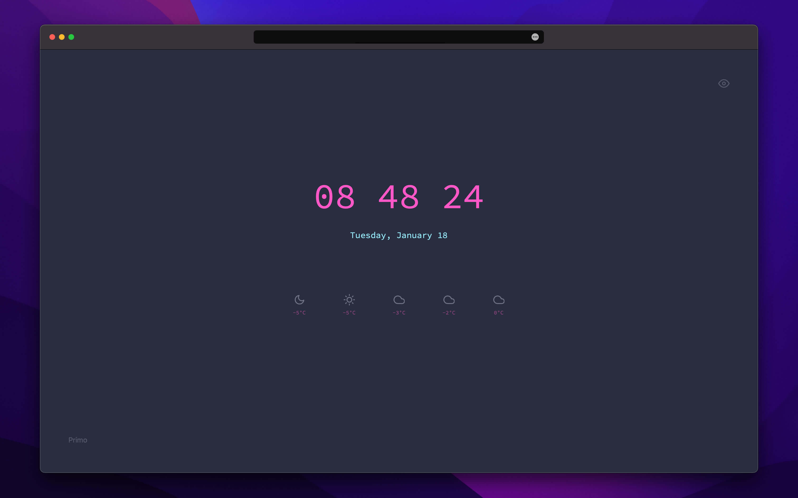

<div align="center">
    <br/>
    <h1>Primo 🌤</h1>
    <i>The start</i>
    <br/>
</div>

<br/>
<br/>

Primo is a one-view starting page for the browsers. It shows the weather for the next 12 hours.
With a few themes available you can match the colors by your preferences.

Primo is heavily inspired by an actual Chrome extension that I used many years ago.
Unfortunately, I can't remember the exact name nor find it from Chrome Store to give
full credits.

<br/>
<br/>

<div align="center">
    
</div>

<br/>
<br/>

## Usage

Primo uses the browser's geolocation to get your current position to fetch weather forecasts
for the location. If you don't allow location Primo will only show the current time.

From the top right, you can switch themes. Selection will be saved to local storage.

## Quickstart with Docker

To get project running locally with Docker, run

```sh
yarn docker:serve

# alias for "docker-compose -f docker-compose.local.yml up"
```

Open [http://localhost:5000](http://localhost:5000)

## Requirements

-   node.js `>= 14`
-   yarn

## Development

1. Install dependecies

    ```sh
    yarn install
    ```

2. Start development server with watch mode

    ```sh
    yarn dev
    ```

3. Start coding

## Testing

### Unit

For unit tests the project uses Jest. Tests are in `src` directory among other
source files prefixed with `*.test.(ts|tsx)`.

To run unit tests run command

```sh
yarn test
```

### E2E

Project uses the Cypress for End-to-End (E2E) tests. Tests are in `cypress/integartion` directory.

To run e2e tests, run command

```sh
yarn test:e2e
```

### Type checks

Project uses TypeScript.

To run type checking across the whole project, run command

```sh
yarn typecheck
```

### Linting

Project uses ESLint for linting. That is configured in `.eslintrc.js`.

To run linting with auto-fix, run command

```sh
yarn lint
```

### Formatting

[Prettier](https://prettier.io/) is used for auto-formatting. It's recommended to install an editor plugin (like the [VSCode Prettier plugin](https://marketplace.visualstudio.com/items?itemName=esbenp.prettier-vscode)) to get auto-formatting on save.

To run formating, run command

```sh
yarn format
```

## Deployment

Project is hosted in [Vercel](https://vercel.com).

The `main` branch will be automatically deployed to production.
